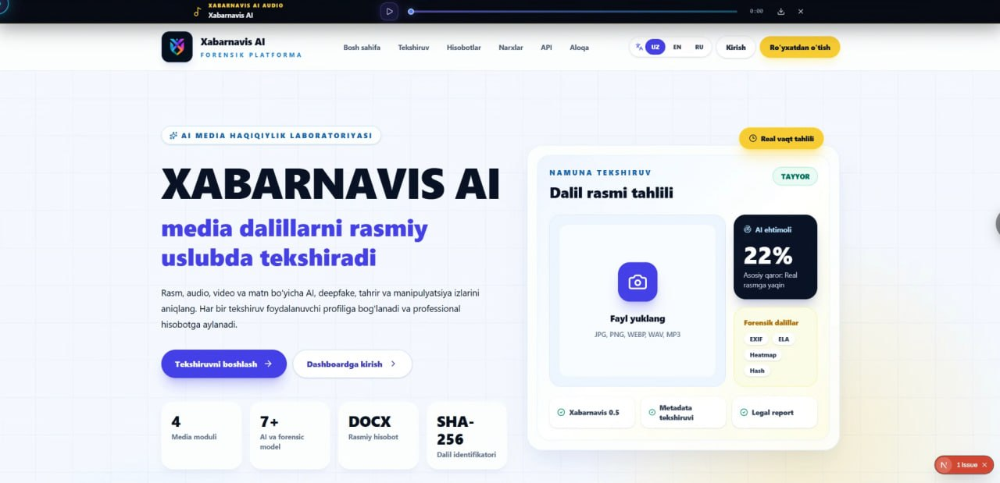
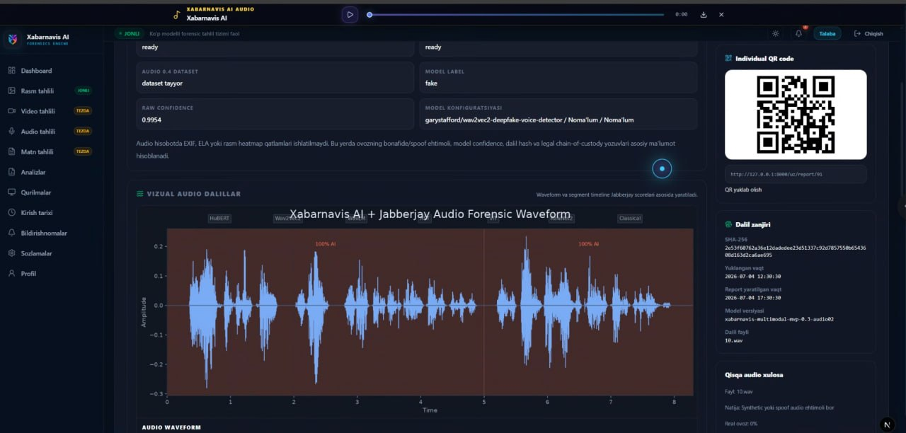
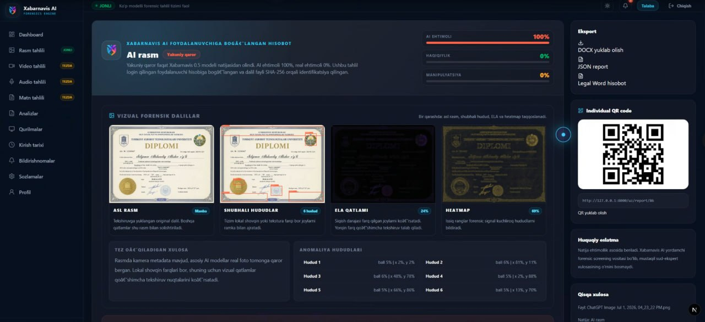

# Xabarnavis AI Forensic Platform

[](apps/web)
[](apps/api)
[](#features--imkoniyatlar)
[](#architecture--arxitektura)

Xabarnavis is a multimodal media-authenticity and forensic analysis platform for image, audio, video, and text evidence. It combines model outputs, metadata, signal-level indicators, explainable score fusion, evidence hashing, and professional report generation in one web dashboard.

**O'zbekcha:** Xabarnavis — rasm, audio, video va matn dalillarini tekshiruvchi ko'p modelli media-forensika platformasi. Tizim AI modellari, metadata, signal belgilari, izohlanadigan baholash, SHA-256 dalil identifikatsiyasi va professional hisobotlarni yagona dashboard'da birlashtiradi.



## Navigation

- [Overview / Umumiy ko'rinish](#overview--umumiy-korinish)
- [Screenshots / Interfeys](#screenshots--interfeys)
- [Mathematical model / Matematik model](#mathematical-model--matematik-model)
- [Features / Imkoniyatlar](#features--imkoniyatlar)
- [Architecture / Arxitektura](#architecture--arxitektura)
- [Quick start / Ishga tushirish](#quick-start--ishga-tushirish)
- [Repository rules](#repository-rules)

## Overview / Umumiy ko'rinish

Xabarnavis associates every analysis with an authenticated user and produces traceable evidence artifacts. The current pipeline supports forensic visualizations, per-model results, fused scores, evidence hashes, QR-linked report pages, and JSON/DOCX exports.

**O'zbekcha:** Har bir tahlil foydalanuvchi hisobiga bog'lanadi. Natijaga model javoblari, vizual dalillar, umumlashtirilgan baholar, dalil hashi, QR orqali ochiladigan sahifa va JSON/DOCX hisobotlar kiradi.

> [!IMPORTANT]
> Xabarnavis scores are decision-support indicators, not proof of authorship and not calibrated legal certainty. Results must be reviewed together with source provenance, metadata, visual evidence, and domain-expert judgment.

> **Muhim:** Xabarnavis baholari mualliflikning mutlaq isboti yoki kalibrlangan huquqiy aniqlik emas. Natija fayl manbasi, metadata, vizual dalillar va mutaxassis xulosasi bilan birga baholanishi kerak.

## Screenshots / Interfeys

### Audio forensic report / Audio-forensika hisoboti

The audio workspace presents model confidence, waveform evidence, segment-level labels, SHA-256 chain-of-custody data, and a QR-linked report.

**O'zbekcha:** Audio sahifasi model ishonchini, waveform dalilini, segment belgilarini, SHA-256 dalil zanjirini va QR orqali ochiladigan hisobotni ko'rsatadi.



### Image forensic report / Rasm-forensika hisoboti

The image report compares the original evidence, a signal overlay, ELA residuals, and a forensic heatmap. It also records anomaly regions and exports the result as JSON or a legal-style DOCX report.

**O'zbekcha:** Rasm hisoboti asl dalilni signal overlay, ELA qoldig'i va forensic heatmap bilan taqqoslaydi. Anomaliya hududlari qayd etilib, natija JSON yoki rasmiy uslubdagi DOCX shaklida eksport qilinadi.



## Mathematical model / Matematik model

The current MVP uses an explainable weighted fusion of normalized indicators. For any value $x$, the clamp operation keeps the score in the interval $[0,1]$:

$$
\operatorname{clamp}(x)=\min(1,\max(0,x))
$$

### AI-generation score

$$
A=\operatorname{clamp}(0.45f+0.25t+0.20g+0.10m)
$$

### Manipulation score

$$
M=\operatorname{clamp}(0.30e+0.25n+0.15j+0.15l+0.15d+0.05m)
$$

### Real-camera score

$$
R=\operatorname{clamp}(1-\max(A,M)+0.15c)
$$

The selected class is the largest of the three scores:

$$
\hat{y}=\operatorname*{arg\,max}_{k\in\{R,A,M\}} k
$$

If $s=\max(R,A,M)$, confidence is assigned using the implemented thresholds:

$$
\operatorname{confidence}(s)=
\begin{cases}
\text{High}, & s\ge 0.75\\
\text{Medium}, & 0.55\le s<0.75\\
\text{Low}, & s<0.55
\end{cases}
$$

| Symbol | Indicator | O'zbekcha izoh |
|---|---|---|
| $f$ | Frequency-domain anomaly | Chastota sohasidagi anomaliya |
| $t$ | Texture uniformity | Teksturaning noodatiy bir xilligi |
| $g$ | Generator-software metadata | AI generator dasturi metadata belgisi |
| $m$ | General metadata anomaly | Umumiy metadata nomuvofiqligi |
| $e$ | Edge inconsistency | Qirralardagi nomuvofiqlik |
| $n$ | Noise inconsistency | Shovqin profilidagi nomuvofiqlik |
| $j$ | JPEG blocking | JPEG blok artefaktlari |
| $l$ | ELA anomaly | Error Level Analysis qoldig'i |
| $d$ | Editor-software metadata | Tahrirlash dasturi metadata belgisi |
| $c$ | Camera provenance | Kamera kelib chiqishi belgisi |

These equations document the current explainable MVP fusion in [`fusion.py`](apps/api/app/services/fusion.py). Individual model adapters may also provide their own probabilities and evidence; the values above should be interpreted as heuristic forensic indicators rather than calibrated probabilities.

**O'zbekcha:** Formulalar joriy MVP fusion mantiqini ifodalaydi. Alohida modellar qo'shimcha ehtimol va dalillar qaytarishi mumkin; yuqoridagi qiymatlar kalibrlangan ehtimol emas, balki tushuntiriladigan forensik indikatorlardir.

## Features / Imkoniyatlar

- Image upload, metadata inspection, ELA, residual heatmaps, and anomaly regions
- Audio waveform, anti-spoof/deepfake adapters, and segment evidence
- Video frame/audio extraction and multi-model research adapters
- Text evidence intake and structured case handling
- Local and external model registry with per-model status
- Authenticated user sessions, device history, and private case archives
- SHA-256 evidence identification and chain-of-custody fields
- JSON and DOCX report generation with QR/public report pages
- PostgreSQL production target with SQLite local-development fallback

## Architecture / Arxitektura

```text
User
  -> Next.js web application
  -> FastAPI forensic API
  -> Media preprocessing and signal extraction
  -> Local/external AI model adapters
  -> Explainable score fusion
  -> SQLite (local) or PostgreSQL + Redis (production target)
  -> JSON/DOCX report + QR/public report page
```

```text
apps/       FastAPI API and Next.js web application
ml/         Model registry and model-family metadata
data/       Local datasets; excluded from Git
artifacts/  Model weights, runs, reports, and logs; excluded from Git
storage/    Runtime uploads, reports, profiles, and local database
infra/      Docker, nginx, PostgreSQL, and systemd deployment files
scripts/    Dataset, training, evaluation, and setup utilities
docs/       Architecture, datasets, security, training, and deployment guides
```

Further reading:

- [Architecture](docs/architecture.md)
- [API](docs/api.md)
- [Datasets](docs/datasets.md)
- [Model benchmarks](docs/model_benchmarks.md)
- [Training guide](docs/training_guide.md)
- [Deployment](docs/deployment.md)

## Quick Start / Ishga tushirish

### Full website

```powershell
python -m venv .venv
.\.venv\Scripts\Activate.ps1
pip install -r requirements.txt
python manage.py runserver
```

Open:

- Website: `http://127.0.0.1:8000`
- API health: `http://127.0.0.1:8001/health`
- Swagger UI: `http://127.0.0.1:8001/docs`

Stop both development servers:

```powershell
python manage.py stopserver
```

### Backend only

```powershell
cd apps\api
python -m uvicorn app.main:app --reload --port 8001
```

### Frontend only

```powershell
cd apps\web
pnpm install
pnpm dev -- --hostname 127.0.0.1 --port 8000
```

## Repository Rules

Git contains source code, documentation, manifests, and lightweight metadata only. Do not commit generated or private runtime assets:

- `apps/web/node_modules/` and `apps/web/.next/`
- `data/datasets/`, `data/raw/`, `data/processed/`, `data/ready/`, and `data/holdout/`
- `artifacts/models/`, `artifacts/runs/`, `artifacts/reports/`, and `artifacts/logs/`
- `storage/uploads/`, `storage/reports/`, `storage/profiles/`, and local databases
- `.env`, private keys, credentials, and access tokens

Track datasets and models through lightweight metadata and reproducible scripts:

- [`docs/datasets.md`](docs/datasets.md)
- [`docs/model_benchmarks.md`](docs/model_benchmarks.md)
- [`ml/registry/models_registry.json`](ml/registry/models_registry.json)
- [`storage/dataset_inventory.json`](storage/dataset_inventory.json)
- [`scripts/datasets/`](scripts/datasets)

## Forensic reporting principle

Avoid unsupported absolute claims such as **"100% fake."** Prefer probability and confidence language tied to the available evidence:

> The image is highly likely to be AI-generated. This conclusion is based on visual, frequency-domain, metadata, and model-based forensic indicators.

**O'zbekcha:** Mutlaq hukm o'rniga mavjud vizual, chastotaviy, metadata va model dalillariga tayangan ehtimollik hamda ishonch tilidan foydalaning.
